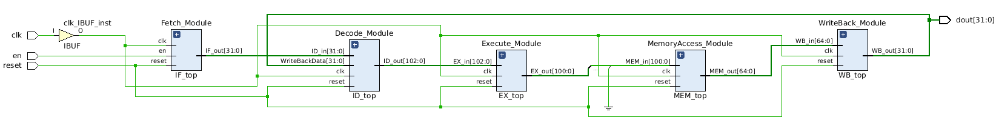
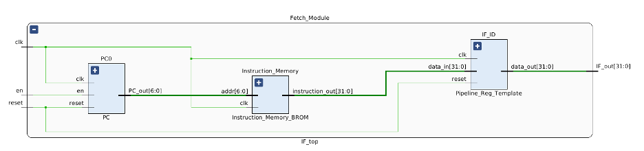
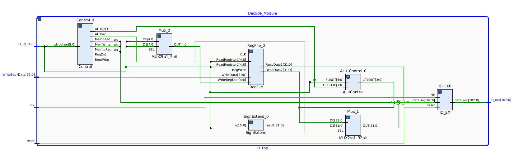
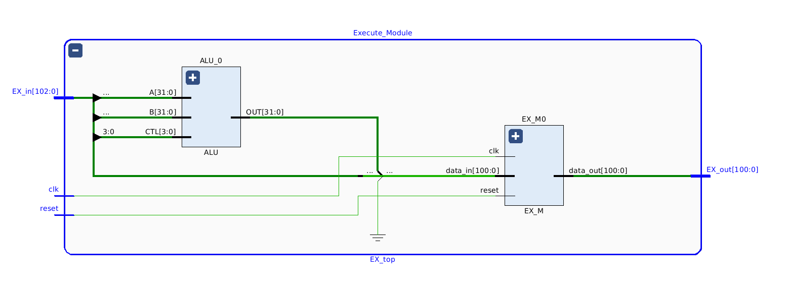
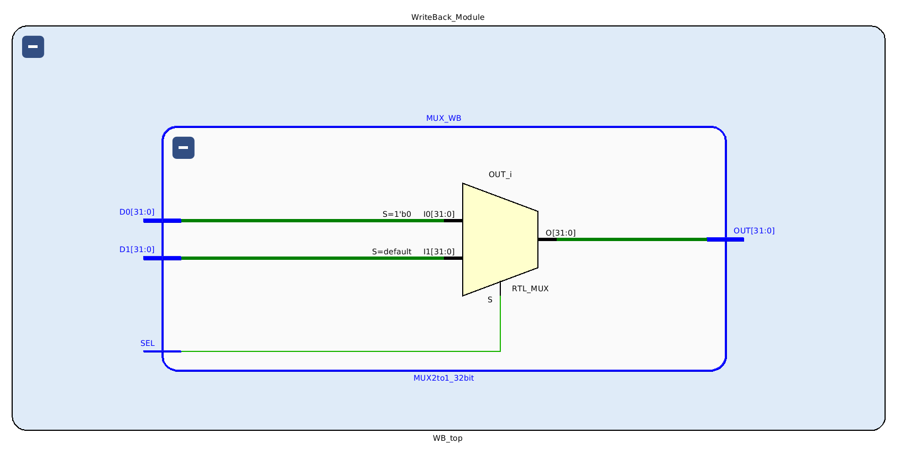
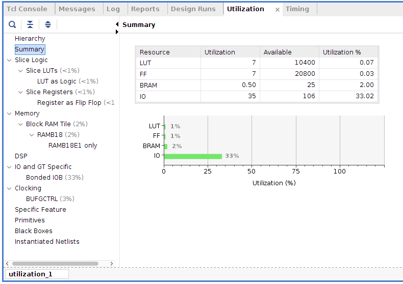

# MIPS Processor Implementation on FPGA

Simple 32-bit, 5-pipeline-stage MIPS CPU which can execute basic arithmetic and logical instructions on a Xilinx Artix-7 FPGA emedded on a Digilent Basys 3 development board.

Used Xilinx Vivado Design Suite.
## Schematics

### Top Module

  

### Instruction Fetch Module

  

### Decode Module

  

### Execute Module

  

### Memory Access Module

  

### Write Back Module

  

## Synthesis Utilization Report

  

